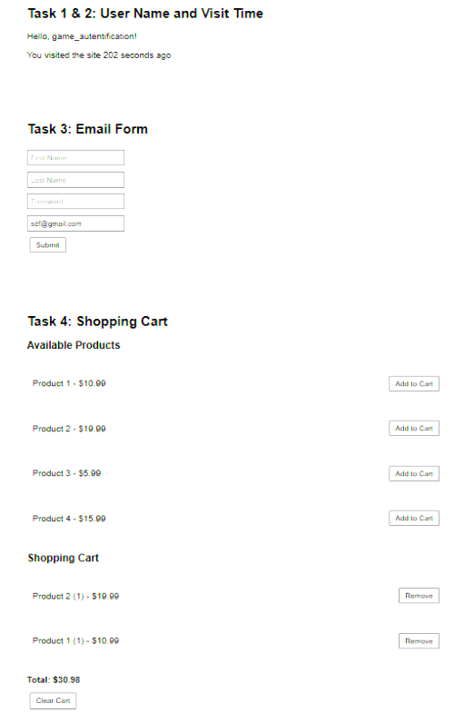

# Управление сессиями PHP через cookie

## Описание
Пример работы с сессиями PHP и cookie.

## Задания
1. Ввод имени → приветствие
2. Подсчет времени сессии
3. Автозаполнение email
4. Корзина товаров

## Скриншоты

## Используемые технологии
- PHP
- HTML
- Sessions & Cookies

## Как запустить
1. Установить PHP (например XAMPP)
2. Скопировать проект в htdocs
3. Открыть http://localhost/index.php
